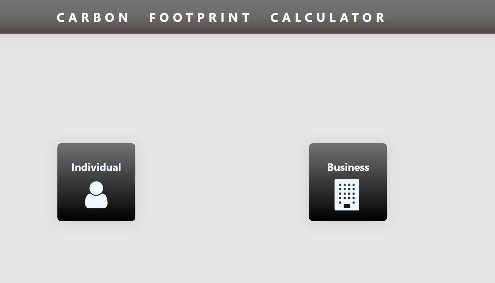
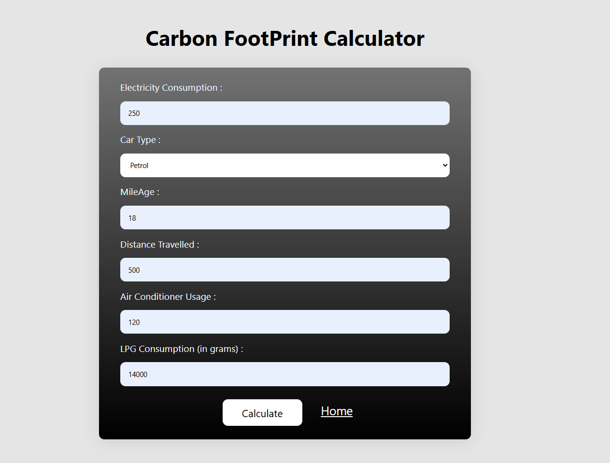
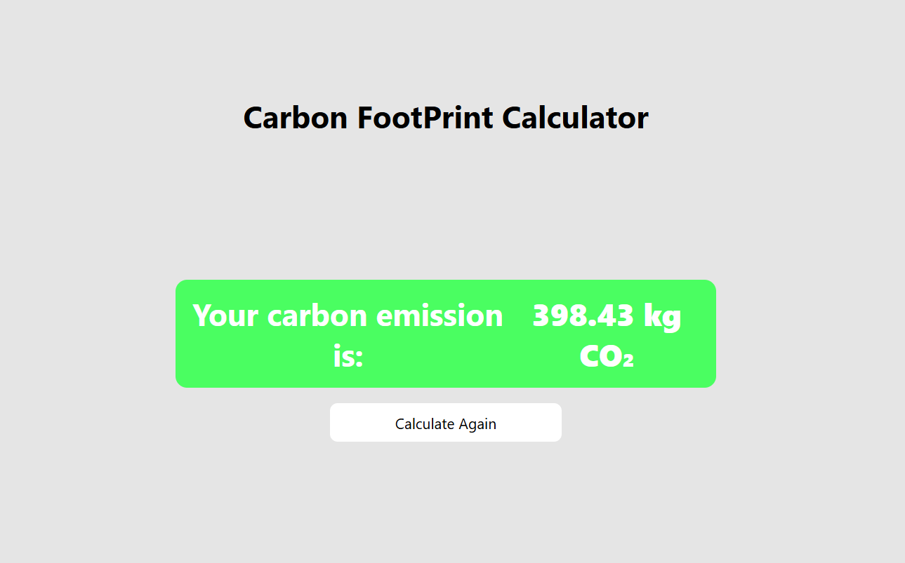

# 🌍 Carbon Footprint Calculator

A simple web-based **Carbon Footprint Calculator** built using **HTML, CSS, and JavaScript** that estimates an individual's carbon dioxide (CO₂) emissions based on daily energy consumption and transportation habits.

---

## 📌 Overview

Climate change is one of the biggest global challenges, and reducing carbon emissions starts with understanding our own carbon footprint.

This project allows users to estimate their approximate CO₂ emissions by entering:

- ⚡ Electricity Consumption
- 🚗 Vehicle Type
- ⛽ Vehicle Mileage
- 🛣 Distance Travelled
- ❄ Air Conditioner Usage
- 🔥 LPG Consumption

The calculator then computes the estimated carbon emissions in **kilograms of CO₂ (kg CO₂)**.

---

# 🚀 Features

- Clean and responsive user interface
- Individual carbon footprint estimation
- Supports Petrol and Diesel vehicles
- Includes electricity consumption
- Includes LPG usage
- Includes Air Conditioner usage
- Instant calculation using JavaScript
- No backend required
- Beginner-friendly project

---

# 🛠 Tech Stack

| Technology | Purpose |
|------------|----------|
| HTML5 | Structure of the website |
| CSS3 | Styling and responsive design |
| JavaScript (ES6) | Carbon footprint calculations |
| Live Server | Local development |

---

# 📂 Project Structure

```
Carbon-Footprint-Calculator/
│
├── index.html
├── individual.html
├── business.html
├── style.css
├── index.css
├── script.js
└── README.md
```

---

# ⚙️ How It Works

The application collects user inputs from the HTML form.

Example inputs:

| Input | Example |
|-------|---------|
| Electricity | 250 Units |
| Vehicle | Petrol |
| Mileage | 18 km/l |
| Distance | 500 km |
| AC Usage | 120 Hours |
| LPG | 14000 grams |

These values are passed to the JavaScript function:

```javascript
calculateFootPrint(
    bill,
    vehicle,
    mileage,
    distance,
    ac,
    gas
);
```

The function calculates emissions from four different sources.

---

# 🧮 Calculation Logic

## 1️⃣ Vehicle Emissions

Fuel consumed:

```
Fuel Used = Distance / Mileage
```

Vehicle emission:

```
Vehicle CO₂ = Fuel Used × Emission Factor
```

Emission Factors:

| Fuel | Factor |
|------|---------|
| Petrol | 2.31 kg CO₂/L |
| Diesel | 2.68 kg CO₂/L |

Example:

```
Distance = 500 km

Mileage = 18 km/L

Fuel Used = 500 / 18

= 27.78 L

Vehicle CO₂

= 27.78 × 2.31

≈ 64.17 kg
```

---

## 2️⃣ Electricity Emissions

Formula

```
Electricity CO₂

= Electricity Units × 0.93
```

Example

```
250 × 0.93

= 232.5 kg CO₂
```

---

## 3️⃣ Air Conditioner Usage

Approximate emission factor

```
0.5 kg CO₂ per hour
```

Formula

```
AC CO₂

= Hours × 0.5
```

Example

```
120 × 0.5

= 60 kg CO₂
```

---

## 4️⃣ LPG Emissions

The user enters LPG in **grams**.

First convert grams to kilograms:

```
kg = grams / 1000
```

Formula

```
LPG CO₂

= LPG (kg) × 2.983
```

Example

```
14000 g

= 14 kg

14 × 2.983

≈ 41.76 kg CO₂
```

---

# 📊 Total Carbon Footprint

```
Total CO₂

=

Vehicle

+

Electricity

+

Air Conditioner

+

LPG
```

Example

```
64.17

+

232.50

+

60.00

+

41.76

=

398.43 kg CO₂
```

Output:

```
Your carbon emission is:

398.43 kg CO₂
```

---

# 💡 Emission Factors Used

| Activity | Factor |
|-----------|---------|
| Petrol | 2.31 kg CO₂/L |
| Diesel | 2.68 kg CO₂/L |
| Electricity | 0.93 kg CO₂/kWh |
| LPG | 2.983 kg CO₂/kg |
| AC Usage | 0.5 kg CO₂/hour |

---

# ▶️ Running the Project

### Method 1 (Recommended)

Install the Live Server extension in VS Code.

Open:

```
index.html
```

Right Click →

```
Open with Live Server
```

---

### Method 2

Simply open

```
index.html
```

using any modern browser.

---
# 🏠 Home Page

<p align="center">
  
</p>

---

# 📸 Sample Input

<p align="center">
  
</p>

---

# 📈 Sample Output

<p align="center">
  
</p>

---
---

# 🎯 Future Enhancements

- 🌱 Tree plantation recommendation
- 📊 Monthly carbon footprint analytics
- 📈 Graphical emission charts
- ☁ Backend database integration
- 👥 User authentication
- 📄 Downloadable emission report (PDF)
- 🌍 Country-specific emission factors
- 🔋 Renewable energy suggestions
- 🚲 Eco-friendly travel recommendations
- 🤖 AI-powered carbon reduction tips

---

This project is developed for educational purposes and can be modified and reused with proper attribution.
